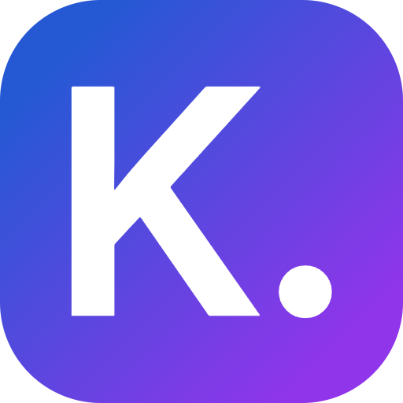

# Kolori

<div align="center">
  
  <p><em>A modern LED control app for WLED devices with beautiful presets and scheduling</em></p>
  
  [](https://opensource.org/licenses/MIT)
  [](https://reactjs.org/)
  [](https://vitejs.dev/)
  [](https://capacitorjs.com/)
</div>

## 🎯 Description

Kolori is a modern, intuitive web and mobile application for controlling WLED (WiFi LED Controller) devices. Built with React and Capacitor, it provides a beautiful interface for managing your LED strips with features like preset management, playlist creation, scheduling, and real-time control.

Whether you're setting up ambient lighting for your home, creating dynamic displays, or managing multiple LED installations, Kolori offers the tools you need with a polished, user-friendly experience.

## ✨ Features

### 🎨 **LED Control & Effects**

- **Custom Effects Creation**: Build and save your own lighting effects with full palette support. Generates card gradient that matches the selected palette
- **Seasonal Presets**: Pre-configured themes for holidays and special occasions
- **Real-time Control**: Instant effect application with WebSocket connectivity
- **Effect Testing and Live View**: Preview effects before saving to ensure perfect results

### 📱 **Multi-Device Management**

- **Device Discovery**: Easy setup with IP address or mDNS hostname support
- **Multi-Device Support**: Manage multiple WLED controllers from one interface
- **Connection Monitoring**: Real-time device status with automatic reconnection

### 🎵 **Playlist & Scheduling**

- **Playlist Builder**: Create dynamic sequences of effects with custom timing
- **Smart Scheduling ( WIP )**: Automatic lighting control based on time of day

### 🌓 **Modern UI/UX**

- **Dark & Light Themes**: Beautiful interface that adapts to your preference
- **Responsive Design**: Perfect experience on desktop, tablet, and mobile

### 📲 **Cross-Platform**

- **Static Web App**: Can be run locally
- **Android & IOS (soon) Support**: Native mobile app with Capacitor integration
- **Offline Capabilities**: Core functionality works without internet connection

## 📸 Screenshots

### Web Interface

```
[Screenshot: Main dashboard with device list and presets]
[Screenshot: Effect creation interface]
[Screenshot: Playlist builder]
[Screenshot: Settings and device management]
```

### Mobile App

```
[Screenshot: Mobile interface showing responsive design]
[Screenshot: Android app with native status bar integration]
[Screenshot: Effect testing on mobile]
```

## 🛠️ Development

### Prerequisites

Before you begin, ensure you have the following installed:

- **Node.js** (v18.0.0 or higher)
- **npm** (v8.0.0 or higher)
- **Git** for version control

For mobile development:

- **Android Studio** (for Android builds)
- **Xcode** (for iOS builds, macOS only) ( UNTESTED for IOS )
- **Java Development Kit (JDK)** 17 or higher

### Installation

1. **Clone the repository**

   ```bash
   git clone https://github.com/mrkprdo/kolori.git
   cd kolori
   ```

2. **Install dependencies**

   ```bash
   npm install
   ```

3. **Start development server**

   ```bash
   npm run dev
   ```

   The app will be available at `http://localhost:5173`

### Dependencies

#### Core Dependencies

- **React 19.1.1** - Modern UI library with latest features
- **Lucide React** - Beautiful, customizable icons
- **Capacitor 7.4.2** - Cross-platform mobile app framework

#### Development Dependencies

- **Vite 7.1.0** - Fast build tool and development server
- **Tailwind CSS 3.4.17** - Utility-first CSS framework
- **ESLint** - Code linting and quality assurance
- **PostCSS & Autoprefixer** - CSS processing and vendor prefixes

#### Mobile Specific

- **@capacitor/android** - Android platform integration
- **@capacitor/ios** - iOS platform integration
- **@capacitor/status-bar** - Native status bar control

## 🏗️ Building

### Web Application (Static)

Build the optimized static web application:

```bash
# Production build
npm run build

# Preview the production build locally
npm run preview
```

The built files will be in the `dist/` directory and include:

- Minified JavaScript and CSS bundles
- Optimized images and assets
- Service worker for PWA functionality
- Gzipped files for optimal loading performance

### Android Application

Build the native Android app:

```bash
# Sync web assets to Android project
npm run mobile:sync

# Open Android Studio for building and testing
npm run mobile:android

# Build and run directly on connected device/emulator
npm run mobile:run:android
```

**Android Build Process:**

1. Web assets are copied to `android/app/src/main/assets/public`
2. Capacitor configuration is updated
3. Android Studio opens for final build and deployment
4. Generated APK can be found in `android/app/build/outputs/apk/`

### iOS Application (macOS only)

Build the native iOS app:

```bash
# Sync web assets to iOS project
npm run mobile:sync

# Open Xcode for building and testing
npm run mobile:ios

# Build and run directly on connected device/simulator
npm run mobile:run:ios
```

## 🔧 Configuration

### Capacitor Configuration

The app includes mobile-specific configuration in `capacitor.config.json`:

- **Mixed content support** for HTTP WLED devices on HTTPS
- **Network permissions** for device discovery
- **Custom app icons** and splash screens
- **Status bar styling** for native mobile experience

## 🤝 Contributing

We welcome contributions to Kolori! Please read our contributing guidelines before submitting pull requests.

### Development Workflow

1. Fork the repository
2. Create a feature branch (`git checkout -b feature/amazing-feature`)
3. Make your changes
4. Run tests and linting (`npm run lint`)
5. Commit your changes (`git commit -m 'Add amazing feature'`)
6. Push to the branch (`git push origin feature/amazing-feature`)
7. Open a Pull Request

### Code Style

- Follow ESLint configuration
- Use conventional commit messages
- Write descriptive variable and function names
- Add comments for complex logic

## 📄 License

This project is licensed under the MIT License - see the [LICENSE](LICENSE) file for details.

## 🙏 Acknowledgments

- **WLED Project** - For the amazing LED controller firmware
- **React Team** - For the excellent UI library
- **Capacitor Team** - For seamless mobile app development
- **Tailwind CSS** - For the utility-first CSS framework
- **Lucide** - For the beautiful icon set

## 📞 Support

If you encounter any issues or have questions:

1. Check the [Issues](https://github.com/yourusername/kolori/issues) page
2. Create a new issue with detailed information
3. Include device information, browser version, and steps to reproduce

---

<div align="center">
  <p>Made with ❤️ for the WLED community</p>
</div>
